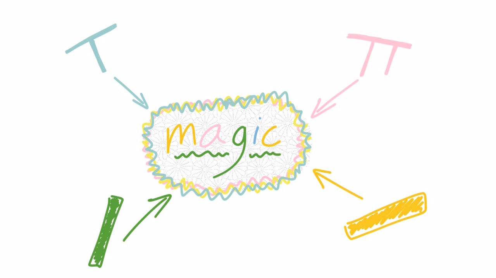

# Competence Development Patterns

Many organisations have a culture of doing much of their competence development in some form of group. In a group, individuals can share experiences with each other, see things from different perspectives and leverage the group's diversity in other ways. More importantly, doing competence development together is often more fun.

However, there is often a tendency to follow a certain form of communication, basically the "teacher pattern": one person has prepared some material before the session and then presents it to the group, with various session length. Another common pattern is the "lab" pattern.

Both of these patterns are familiar to us from our time in school and also from conferences (presentations and  conference workshops). There are nothing intrinsically wrong with these patterns, but there exists other patterns as well and *some patterns are better than others, depending on the purpose and context*.

This site is an attempt to introduce other competence development patterns for groups to use.

On the [issues page](https://github.com/jayway/competence-development-patterns/issues/), there are more patterns to try and/or document. Also, as the number of documented patters grow, it's likely that we need a better way to organise and categorise the patterns.

Pull requests with improvements are encouraged.

## On planning and preparation

For planned competence development sessions, there are several aspects to think about, for example:

* Is there enough time to prepare?
* Is there some low hanging fruit that can easily be shared?
* Does the session belong to a certain theme (e.g. reactive programming)? However, sometimes it’s good to *not* have a theme.
* Will everybody be able to understand the session? Too easy? Too hard? Could the session be divided into two - one for beginners and one for participants with more experience?
* Making sure the schedule holds (having some fixed session length might help)
* Think about food and coffee breaks
* Due to a lot of factors, people sometimes need to leave ealier (i.e. maybe they need to pick up children at kindergarten), so it’s good be aware of that.

## Contribute

Install [gitbook](https://github.com/GitbookIO/gitbook) with `npm install -g gitbook-cli`

Start gitbook with `gitbook serve`

Feel free to contribute to this collection of patterns by sending pull requests to [Competence Development Patterns on GitHub](https://github.com/jayway/competence-development-patterns) <3