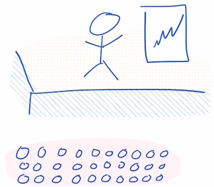

### Traditional presentation

#### Context
Someone has more knowledge of a certain subject than most of the individuals in the group and the group would benefit of getting access to that knowledge.

#### Description
The presenter prepares a presentation before the session and then performs it. It could be that the presenter has no previous knowledge of the subject, in which case the preparation takes longer time.

#### Preparation
A good presentation usually takes a lot of time to prepare. There are a lot of books on this topic, but two of them are "Presentation Zen" and "The Naked Presenter".

#### Pros
The group can be introduced to new techniques, concepts and ideas - being filtered and composed by the presenter. The presenter prioritises the information and also orders it, hopefully in the best way possible. Doing a presentation develops that person's presentation skills, which is important in many other contexts. **Also, the presentation can be reused for external seminars or conferences.**

#### Cons
A presentation can take very long time to prepare. Also, the communication mostly flows in only one way and that makes the other in the group more passive. It might strengthen the thought that someone else is responsible for my competence development and not myself.